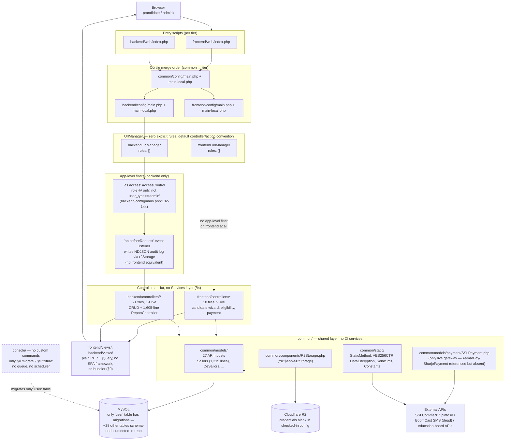

# Architecture Document — join-navy-sailor-legacy

**Generated:** 2026-08-20 | Companion to `repository_inventory.md`, `route_inventory.md`, `controller_inventory.md`, `view_inventory.md`, `javascript_inventory.md`, `component_inventory.md`, `css_inventory.md`, `middleware_inventory.md`, `model_inventory.md`, `service_inventory.md` (all in `../00-inventories/`).

This is a **Yii 2.0 "advanced" project template** application (`common/`, `frontend/`, `backend/`, `console/`), not Laravel — the sibling `join-navy-officer-legacy` repo this document will eventually be compared against. Every claim below is cited to a Phase 0 inventory doc (and, transitively, to the exact file/line that doc itself verified). Nothing here is re-derived from scratch; this document synthesizes and cross-references the 10 inventories rather than re-reading the whole tree.

---

## 1. Framework & language versions

Source: `composer.json:8-19`, cross-referenced in `../00-inventories/repository_inventory.md:43`.

| Requirement | Version constraint |
|---|---|
| PHP | `>=7.4.0` |
| `yiisoft/yii2` | `~2.0.45` (Yii 2.0 core) |
| `yiisoft/yii2-bootstrap5` | `~2.0.2` |
| `yiisoft/yii2-symfonymailer` | `~2.0.3` |
| `yiisoft/yii2-jui` | `~2.0.0` (jQuery UI widgets — `DatePicker`, etc.) |
| `nesbot/carbon` | `^2.65` |
| `skeeks/yii2-slug-behavior` | `*` (unpinned) |
| `kartik-v/yii2-widget-select2` | `dev-master` (unpinned, dev-branch dependency in production) |
| `2amigos/qrcode-library` | `^2.0` |
| `2amigos/yii2-tinymce-widget` | `~1.1` |
| `mpdf/mpdf` | `^8.1` |
| `picqer/php-barcode-generator` | `^2.2` |
| `phpoffice/phpspreadsheet` | `^1.27` |

`composer.json:1-9` — package name `yiisoft/yii2-app-advanced`, description "Yii 2 Advanced Project Template": this project was **never renamed from the stock template identity**, the same "boilerplate never customized" pattern the reference officer-app doc found in its own `composer.json`/README (`../00-inventories/repository_inventory.md:43,115`).

**Notable composer/vendor discrepancy:** the codebase actively uses `PhpOffice\PhpWord` (`backend/controllers/ReportController.php::actionReferenceCandidateWord()`, a live DOCX export action, plus the dead stub `backend/controllers/TeController.php` — `../00-inventories/controller_inventory.md:342,364,49`) and `phpoffice/phpword` **is present under `vendor/phpoffice/phpword`**, but it does not appear anywhere in `composer.json` or `composer.lock` — it was added to the vendor tree outside Composer's own tracking, so a fresh `composer install` on this lockfile would not reproduce a working `vendor/` directory for that feature.

require-dev (`composer.json:31-41`): `yiisoft/yii2-debug`, `yiisoft/yii2-gii`, `yiisoft/yii2-faker`, `phpunit/phpunit ~9.5.0`, `codeception/*` (functional/acceptance/unit test runner, configured per-tier — see §2) — matching the near-zero real test coverage documented in `../00-inventories/repository_inventory.md:18,64,78,90,114,129`.

---

## 2. Application architecture — the "advanced template" module structure

Source: `../00-inventories/repository_inventory.md` (Top-level layout, `common/`/`frontend/`/`backend/`/`console/` sections), `../00-inventories/route_inventory.md` §"How a URL maps to code" and §"Entry scripts".

The Yii2 **advanced template** splits one codebase into four independently-bootstrapped tiers, each with its own entry point, config, and (for the two web tiers) webroot:

| Tier | Role | Entry script | Own `web/`? | Own `config/`? |
|---|---|---|---|---|
| `common/` | Shared code: AR models (`common/models/`, 27 files + 2 sub-namespaces), static helper classes (`common/static/` — `StaticMethod`, `AES256CTR`, `DataEncryption`, `SendSms`, `Constants`), one app component (`common/components/R2Storage.php`), mail views, one widget | n/a — never bootstrapped standalone, always merged into the other three | No | Yes (`bootstrap.php`, `main.php`, `main-local.php`, `params.php`) |
| `frontend/` | Public candidate-facing app — eligibility check, sailor/de-sailor application wizard, online payment, application status | `frontend/web/index.php` | Yes (5.4 MB) | Yes |
| `backend/` | Admin/back-office app — CRUD for sailors, batches, centers, districts/upazilas/unions, subjects, eligibility rules, reporting | `backend/web/index.php` | Yes (18 MB, dominated by the 17 MB "Hyper" admin theme asset tree) | Yes |
| `console/` | CLI tier — migrations + console commands | `yii` (repo root) | No | Yes |

Each web tier's entry script merges configuration in a fixed order — **`common/config/main.php` → `common/config/main-local.php` → `{tier}/config/main.php` → `{tier}/config/main-local.php`** (`../00-inventories/route_inventory.md:56-66`) — so `frontend` and `backend` are two separate `yii\web\Application` instances that happen to share the `common` model/config layer, not two route groups inside one app. There is no Laravel-style `Route::prefix('admin')->group(...)`: **"admin" is not a URL prefix here, it is an entirely separate Yii application**, served from its own entry script/webroot/subdomain per deployment (`../00-inventories/route_inventory.md:54`).

**No shared session between frontend and backend.** The two apps register distinct session/identity-cookie names in their respective `config/main.php`:

| | Session cookie name | Identity cookie name |
|---|---|---|
| frontend | `join_bd_navy_front` | `_join_bd_navy_front` |
| backend | `join_navy-backend` | `_join_navy-backend` |

(`../00-inventories/middleware_inventory.md` §2, `frontend/config/main.php`/`backend/config/main.php` tables). Both apps point `components.user.identityClass` at the same `common\models\User` AR class and the same `user` table, but a candidate authenticated on `frontend` carries no session into `backend`, and vice versa — cookie-namespace isolation is the practical backstop for tier separation, not a shared guard/session layer (`../00-inventories/middleware_inventory.md` §4.4).

`console/` has no custom controllers at all — `console/controllers/` contains only `.gitkeep` — so "console routes" reduce to Yii framework defaults (`yii migrate`, `yii fixture/*`, `yii cache/*`); the only project-specific mapping is `fixture → yii\console\controllers\FixtureController` against `common/fixtures/UserFixture.php` (`../00-inventories/route_inventory.md:132-154`, `../00-inventories/repository_inventory.md:94-99`).

The root `.htaccess` routes everything to `frontend/web/` by default — `frontend` is the tier served at the domain root; `backend` is reached at its own subpath/subdomain via its own webroot (`../00-inventories/repository_inventory.md:45`).

---

## 3. Environments / config-switching mechanism

Source: `../00-inventories/repository_inventory.md` (`environments/`, `init`/`init.bat` rows).

`environments/index.php` returns a manifest of named environments — `Development` → `environments/dev/`, `Production` → `environments/prod/` — each declaring which paths need `setWritable` (runtime/assets dirs), which need `setExecutable` (`yii`, `yii_test`), and which config files need a freshly generated `cookieValidationKey`. The `init` (PHP CLI) / `init.bat` (Windows wrapper) tool reads this manifest and **copies the matching `environments/{env}/**` tree over the live tier config folders** (`common/`, `backend/`, `frontend/`, `console/`), either interactively (`php init`) or scripted (`php init --env=Development --overwrite=n`). This is the entire mechanism by which a checkout is pointed at dev vs. prod settings — there is no `.env`/`APP_ENV` file-swap equivalent to Laravel's; it's a one-time file-copy step run at deploy/setup time, not a runtime-read config layer.

`yii`/`yii.bat` (console bootstrap, `YII_ENV=dev` by default) and `yii_test`/`yii_test.bat` (same, plus merges `common/config/test.php`+`test-local.php` and `console/config/test.php`+`test-local.php` for Codeception) are the two CLI entry points this mechanism marks executable.

---

## 4. No Services/Repository layer — fat Controllers and ActiveRecord Models

Source: `../00-inventories/controller_inventory.md` (header note + Summary table), `../00-inventories/service_inventory.md` (header table), `../00-inventories/component_inventory.md` §1-2.

This is the single most consequential architectural difference from the sibling Laravel officer app, which the officer app's own doc documents as having a real (if thin) `app/Services/` layer. **This Yii2 app has no dedicated Services or Repository layer at all.** Business logic lives directly in two places:

1. **Fat controllers.** `backend/controllers/ReportController.php` alone is 1,605 lines / 76.6 KB with 23 actions and no delegated service class (`../00-inventories/controller_inventory.md:339-373`); `frontend/controllers/SailorCandidateController.php` (1,195 lines) and `frontend/controllers/DeSailorController.php` (1,118 lines) each inline the full multi-step application-wizard logic — photo upload, PII encryption, roll-number/exam-date allocation, PDF generation — directly in `action*()` methods (`../00-inventories/repository_inventory.md:73`, `../00-inventories/controller_inventory.md` §DeSailorController/§SailorCandidateController).
2. **Fat ActiveRecord models.** `common/models/Sailors.php` (1,315 lines, the largest model in the app) and its near-twin `common/models/DeSailors.php` each carry ~15-18 custom inline validators encoding Bangladesh-Navy-specific eligibility/academic-track business rules directly inside `rules()`, plus static helper methods (`numberOfApplication()`, `nextRollByBatchId()`, `getLastRollExamDateByDesignationCenter()`, `generateLog()`) that other controllers call directly rather than going through any service abstraction (`../00-inventories/model_inventory.md` §16, "Sailors vs. DeSailors" section).

The closest things to a Services layer, per `../00-inventories/controller_inventory.md`'s own framing and `../00-inventories/service_inventory.md`'s scope table, are:

| Directory | Count | Role |
|---|---|---|
| `common/components/` | 1 | `R2Storage.php` — a Yii **application component** (`Yii::$app->r2Storage`), the closest analogue to a DI-bound service; combines Cloudflare-R2 file storage and NDJSON audit-log read/write in one class (`../00-inventories/service_inventory.md` §1, `../00-inventories/component_inventory.md` §2) |
| `common/models/payment/SSLPayment.php` | 1 | A static-method payment-gateway class living under `models/` by path convention only — not an ActiveRecord (`../00-inventories/service_inventory.md` §2) |
| `common/static/` | 5 | `StaticMethod`, `AES256CTR`, `DataEncryption`, `SendSms`, `Constants` — plain static-helper classes, the de facto "services" layer for encryption/SMS/misc constants, used throughout nearly every controller (`../00-inventories/controller_inventory.md:526`) |
| `common/widgets/`, `common/enumClass/` | 1 each | `Alert.php` (flash-message widget, effectively dead — see `../00-inventories/component_inventory.md` §1), `Status.php` (unused PHP 8.1 enum) |

None of these are DI-registered service classes in the Laravel sense (constructor-injected, interface-bound); `R2Storage` is the only one that is even a registered Yii component, and it is reached via the `Yii::$app->` service-locator pattern, not constructor injection.

**No `app/Jobs`-equivalent either.** `../00-inventories/service_inventory.md:11` and `../00-inventories/controller_inventory.md` "Jobs" section both confirm zero `yii\queue` usage anywhere in the repo — whatever roll-number generation / SMS / audit-log work exists runs synchronously inline inside controller actions (e.g. `SailorCandidateController::actionCompleteApplication()`), not as a dispatched background job. See §11 (Queue system) and §16 (Diagram 2) for how this plays out in the live request flow.

---

## 5. Authorization mechanism — no RBAC, `User.user_type` only

Source: `../00-inventories/middleware_inventory.md` §1, §4, §5, Summary table.

**No RBAC package, no Yii2 RBAC component (`authManager`), and no per-request middleware-equivalent re-check exists anywhere in this codebase.** Confirmed:
- No `authManager` component is registered in any of `common/config/main.php`, `backend/config/main.php`, `frontend/config/main.php`.
- No custom `yii\filters\AuthMethod`/`ActionFilter` subclasses exist anywhere — every access-control filter in the repo is the stock `yii\filters\AccessControl` or `yii\filters\VerbFilter` (`../00-inventories/middleware_inventory.md` §5).
- Only 5 of 31 controllers define any `AccessControl` at all, and two of those five duplicate rules already enforced at the app level (`../00-inventories/middleware_inventory.md` §3.3, Summary table).

**Actual mechanism: a single `User.user_type` string column, checked once, at login time only.** `common/models/LoginForm::validatePassword()` compares the authenticating user's `user_type` against a value the *calling controller* sets before validation — `'admin'` in `backend/controllers/SiteController.php:203`, `'candidate'` in `frontend/controllers/CandidateController.php:177` (and, redundantly, in the orphaned `frontend/controllers/SiteController.php:103` scaffold login):

```php
if ($user && $user->user_type != $this->user_type) {
    $this->addError($attribute, 'You are not ' . $this->user_type . ' user!');
}
```

(`../00-inventories/middleware_inventory.md` §4, item 3.) There is **no per-request re-validation of `user_type`** analogous to the officer app's `IsAdmin`/`IsCandidate` middleware — Yii2 has no route-level middleware pipeline in this app to place such a check into in the first place. `user_type` itself is not even an enum or constant list anywhere (`../00-inventories/middleware_inventory.md:164,313`) — it is validated only as `[['user_group', 'user_type'], 'string']` in `common/models/User::rules()`.

Post-login, the only thing standing between an authenticated identity and every backend admin route is the **app-level `'as access'` behavior** in `backend/config/main.php:132-144` (a global `AccessControl` attached to the `yii\web\Application` object itself, firing on every controller/action's `EVENT_BEFORE_ACTION`): it checks role `@` (any authenticated `common\models\User`, of *any* `user_type`), never `user_type == 'admin'` specifically (`../00-inventories/middleware_inventory.md` §1b). In practice, separate session/cookie namespaces per tier (§2 above) prevent a frontend candidate session from ever reaching backend routes — but nothing at the authorization-filter layer itself enforces the admin/candidate distinction; it is enforced exactly once, at the login form.

The frontend has **no app-level access-control equivalent at all** (`../00-inventories/middleware_inventory.md:66`) — "must be logged in" gating there is either a narrow controller-level `AccessControl` (one controller, partially — `SailorCandidateController`, 2 of 10 actions covered) or a manual `Yii::$app->user->isGuest` check written inline per action, applied inconsistently: `DeSailorController` (`frontend/controllers/DeSailorController.php`) has **zero** access-control coverage on any of its 8 actions, worse than its `SailorCandidateController` sibling (`../00-inventories/middleware_inventory.md` §3.6-§3.8, Summary items 9 and 12).

There is also no per-module/per-action permission granularity of any kind: every authenticated backend user has identical access to every backend route once past the app-level `@`-role check — there is nothing resembling the officer app's two-value-but-at-least-checked `user_type` gate repeated per module.

---

## 6. Schema / migration coverage gap

Source: `../00-inventories/repository_inventory.md:16,19,99,126`, `../00-inventories/model_inventory.md:1-8,766-796` (Cross-cutting observations §1-2, migration file reference).

**Only 2 migrations exist in the entire repo**, both scoped to a single table:

```
console/migrations/m130524_201442_init.php
  up(): createTable('{{%user}}', [id, username, auth_key, password_hash,
        password_reset_token, email, status, created_at, updated_at])

console/migrations/m190124_110200_add_verification_token_column_to_user_table.php
  up(): addColumn('{{%user}}', 'verification_token', string())
```

Yet `common/models/` alone implies roughly **29 distinct domain tables** — `sailors`, `de_sailors`, `sailor_batchs`, `sailor_batch_configuration(_exam_date)`, `sailor_centers`, `sailor_cent_dist_mapping`, `eligibility`, `can_designation`, `can_eligibility_check_info`, `districts`, `upozilas`, `unions`, `subjects`, `send_sms`, `session`, etc. **None of these 28 other tables has any migration history in this repo.** The production schema was almost certainly built and evolved via direct SQL/import, not through Yii's migration system — `console/migrations/` cannot be treated as a source of truth for the schema, and there is no scriptable/replayable schema history to work from. Even the one table that *is* migrated has drifted: 11 of the ~20 columns `common/models/User.php` actually reads/writes (`user_group`, `user_type`, `phone_no`, `dob`, `last_login_ip`, `last_logout`, `login_zone`, `os`, `created_dt`, `updated_dt`, `birth_registration_no`) are absent from both migration files (`../00-inventories/model_inventory.md:664-665,769`).

Practical consequence for any modernization effort: schema (column types, defaults, indexes, foreign keys, charset) must be reverse-engineered from a live database dump or inferred from each AR model's `rules()`/`@property` docblocks — and that inference is lossy, since Yii `rules()` validation (e.g. `'unique'`) is application-level and does not guarantee a corresponding DB-level constraint exists, or vice versa (`../00-inventories/model_inventory.md:768`).

---

## 7. Key composer packages and what each is for

Cross-referencing §1's table against confirmed call sites in `../00-inventories/controller_inventory.md`, `../00-inventories/service_inventory.md`, and `../00-inventories/component_inventory.md`:

| Package | Confirmed usage |
|---|---|
| `yiisoft/yii2-bootstrap5` | `yii\bootstrap5\...` (`Html`, `ActiveForm`, `Breadcrumbs`, `Nav`, `NavBar`) across backend layouts/forms and frontend candidate/eligibility views — the only Bootstrap-Yii-widget namespace in use; zero Bootstrap 3/4 remnants (`../00-inventories/css_inventory.md` "Bootstrap version" section) |
| `kartik-v/yii2-widget-select2` | `Select2` dropdown widget, used inline (not extracted to a shared config) in 13 files across admin report/filter forms and one frontend eligibility view (`../00-inventories/component_inventory.md` §6, "Select2 dropdown") |
| `yiisoft/yii2-jui` | `yii\jui\DatePicker`, used inline across 26 admin CRUD/report forms and 4 frontend date fields — this app's date-picker choice, distinct from the officer app's Flatpickr (`../00-inventories/component_inventory.md` §6) |
| `mpdf/mpdf` | `\Mpdf\Mpdf`, the PDF-generation engine behind every application-form/verification-slip/report PDF export (`DeSailorController::actionDownload()`, `SailorCandidateController::actionDownload()`, and the bulk of `ReportController.php`/`DeSailorReportController.php`'s `*Pdf()` actions — `../00-inventories/controller_inventory.md` respective sections) |
| `phpoffice/phpspreadsheet` | `PhpOffice\PhpSpreadsheet\{Spreadsheet, Writer\Xlsx, ...}`, backing every `*Excel()` export action in `ReportController.php`/`DeSailorReportController.php` — two of those exports (`actionPaymentExcel()` in both controllers, `actionReferenceCandidateExcel()` in `DeSailorReportController`) are confirmed non-functional stubs that write only placeholder text (`"Hello World !"` / `"We are working"`) instead of real data (`../00-inventories/controller_inventory.md:283,290,349`) |
| `phpoffice/phpword` (vendor-only, see §1) | `PhpOffice\PhpWord\{PhpWord, IOFactory}` — one live DOCX export, `ReportController::actionReferenceCandidateWord()`; also imported-but-unused in the dead `TeController` stub (`../00-inventories/controller_inventory.md:342,364,49`) |
| `2amigos/qrcode-library` | Imported for QR-code generation in the candidate-flow, but the only call site found is a **commented-out** block in `DeSailorController::actionPersonalInfo()` (`../00-inventories/controller_inventory.md:124`) |
| `picqer/php-barcode-generator` | Barcode generation — consistent with the committed-by-accident `frontend/web/barcode.png` artifact flagged as dead output in `../00-inventories/repository_inventory.md:77,111,125` |
| `2amigos/yii2-tinymce-widget` | Rich-text editor widget — used per `common/models/CanDesignation.php`'s `description` field passing through `HtmlPurifier::process()` (`../00-inventories/model_inventory.md:24-25`), consistent with a TinyMCE-edited HTML field |
| `nesbot/carbon` | Date/time helper library, available app-wide; specific call sites not enumerated by the Phase 0 docs (out of their grep scope) |
| `skeeks/yii2-slug-behavior` | `SlugBehavior`, attached to `common/models/Districts.php` to auto-generate `slug` from `name_en` (`../00-inventories/model_inventory.md:196`) |

---

## 8. CSS frameworks in use

Source: `../00-inventories/css_inventory.md` (full doc).

Two live asset trees, one dead scaffold bundle per tier — much smaller in scope than the officer app's three-way split:

| Bundle | Framework | Registered by | Status |
|---|---|---|---|
| `frontend/web/navy/css/` (via `AppNavyAsset`) | **Bootstrap v5.0.0-beta3** (raw vendored copy) + Boxicons + Bootstrap Icons + Animate.css, plus the custom "NAVY" template (`style.css`, 55.6 KB; `responsive.css`; `style_step.css`) | `frontend/views/layouts/mainNavy.php`, the sole frontend layout | **Live** — every public/candidate page |
| `backend/web/adminAsset/` (via `AppAdminAsset`) | **"Hyper" Bootstrap 5 admin theme** (compiled, `--ct-*` custom properties) + bundled icon fonts | `backend/views/layouts/admin.php`, the backend's app-wide default layout | **Live** — every authenticated admin page |
| `frontend/web/css/site.css` (via `frontend/assets/AppAsset.php`) | Unmodified Yii2-scaffold default | *nobody* — no frontend layout registers this bundle | **Dead** |
| `backend/web/css/site.css` (via `backend/assets/AppAsset.php`) | Unmodified Yii2-scaffold default | `backend/views/layouts/blank.php`, selected only by `SiteController::actionLogin()` | **Live, but narrowly** — admin login screen only |

No CSS framework beyond Bootstrap 5 is in use anywhere in this repo — confirmed zero `yii\bootstrap\...` (legacy v3/4 namespace) references and zero raw Bootstrap 3/4 CSS files (`../00-inventories/css_inventory.md` "Bootstrap version" section). Two vendor files are present but disabled-in-place rather than removed: `nice-select.css` (commented out alongside its JS counterpart) and `daterangepicker.css` (its JS half is wired, the CSS half was never added to the bundle) — combined 11 KB of orphaned CSS, a much smaller dead-weight footprint than the officer app's hundreds of KB of unused theme-starter-kit CSS (`../00-inventories/css_inventory.md` Cross-cutting findings §7).

---

## 9. JS frameworks/libraries in use

Source: `../00-inventories/javascript_inventory.md` (full doc).

**No SPA framework, no bundler, no `package.json` anywhere in the repo** (`../00-inventories/javascript_inventory.md:10,19`) — this is a pure legacy jQuery-era Yii2 app; unlike the officer app, there is no dead Vite pipeline to describe, because no bundler was ever introduced at all.

| Library | Where |
|---|---|
| jQuery 3.6.0 | Both live asset trees (`navy/js/jquery-3.6.0.min.js`, and bundled again inside `adminAsset/js/vendor.min.js`) — **jQuery loads twice on every admin page**, once via the hardcoded `vendor.min.js` `<script>` tag and once via `AppAdminAsset`'s `yii\web\YiiAsset` dependency publishing `bower-asset/jquery` separately (`../00-inventories/javascript_inventory.md:69`) |
| Bootstrap JS | Bundled per-theme, differing versions (5.0.0-beta3 frontend, 5.2.3 backend via `vendor.min.js`) |
| ApexCharts | `adminAsset/vendor/apexcharts/apexcharts.min.js`, loaded on every admin page via `AppAdminAsset`, but the one view file that would actually chart real data (`demo.dashboard-analytics.js`) is explicitly commented out — **the admin dashboard ships with the charting library loaded but no chart JS wired to it at all** (`../00-inventories/javascript_inventory.md:116`) |
| Kartik Select2, jQuery UI (`DatePicker`) | Registered via their respective composer widget packages (§7), not raw `<script src>` |
| wow.min.js | Scroll-reveal animation on the public site |
| 52 `demo.*.js` "Hyper" theme showcase files + 5 `ui/component.*.js` wrappers | **Entirely unreferenced** by any live Blade-equivalent view (`../00-inventories/javascript_inventory.md:114-119`) — dead theme-starter-kit code shipped but unused, the same pattern the officer app's `admin_v1/libs/` exhibits at larger scale |

**Custom application JS is essentially nonexistent** — the one custom file, `frontend/web/navy/js/main.js` (62 lines), is pure template boilerplate (preloader, sticky header, back-to-top button) with zero navy/candidate-specific logic. Almost all real project logic — cascading district→upazila→union AJAX dropdowns, signup live-availability checks, CRUD-grid AJAX wiring — lives **inline in `<script>` blocks inside view files** instead (11 frontend view files / 16 tag occurrences, 15 backend view files / 22 tag occurrences — `../00-inventories/javascript_inventory.md:123-142`).

A structural reason this pattern is forced rather than merely stylistic: `frontend/assets/AppNavyAsset.php` has its `$depends` array **fully commented out**, so the public site never loads `yii.js`/`yii.activeForm.js` (Yii2's own client-side form-validation script) — meaning every `enableAjaxValidation => true` field config set across the candidate-wizard forms (81-85 occurrences in some single view files, per `../00-inventories/component_inventory.md` §6) is **dead configuration**, and every AJAX-heavy frontend form hand-rolls its own jQuery `$.ajax()` submit/validation logic instead. The backend does not have this problem — `AppAdminAsset` correctly declares `yii\web\YiiAsset` in `$depends`, so ActiveForm client validation is live there.

---

## 10. Authentication system

Source: `../00-inventories/middleware_inventory.md` §2, §4, `../00-inventories/model_inventory.md` §9 (`LoginForm.php`), §23 (`User.php`).

- **Identity model:** both apps set `components.user.identityClass = 'common\models\User'` — one shared `User` table/class backs both admin and candidate logins (`../00-inventories/middleware_inventory.md:106,118`). `User implements \yii\web\IdentityInterface` with the standard Yii2 methods (`findIdentity`, `findByUsername`, `findByPasswordResetToken`, `findByVerificationToken`, `validatePassword`, `generateAuthKey`, etc. — `../00-inventories/model_inventory.md:663`).
- **Session-based, not token-based:** both apps use Yii2's default cookie-backed session auth; no API guard, no Sanctum/Passport-equivalent token layer exists anywhere in this stack.
- **Two parallel login entry points on the frontend**, one live, one orphaned: `frontend/controllers/CandidateController::actionLogin()` is the real, in-use flow (linked from the live `mainNavy.php` layout); `frontend/controllers/SiteController::actionLogin()` is the unmodified Yii2-advanced-template scaffold login, still reachable by direct URL (`/site/login`) but not linked from anywhere in the live UI (`../00-inventories/middleware_inventory.md` §3.6). Both set `$model->user_type` before validating (`'candidate'` in both cases) — see §5 above for how that value is used.
- **CSRF is disabled app-wide** on both `frontend` and `backend`'s `request` component (`components.request.enableCsrfValidation = false` in both `config/main.php` files — `../00-inventories/middleware_inventory.md:105,117`); the various per-controller `beforeAction()` CSRF opt-outs for AJAX/webhook actions found throughout the controller inventory are therefore redundant, not load-bearing.
- **CAPTCHA, not 2FA:** admin login (`backend/controllers/SiteController::actionLogin()`) and both candidate login paths are gated by a hand-rolled arithmetic CAPTCHA (`captureValue()`/session-stored answer), not a real second factor — there is no OTP/email-verification-at-login step comparable to the officer app's admin OTP flow.
- **Third-party call on every login:** `common/models/LoginForm::getLoginAddress($ip)` calls `http://ipinfo.io/{ip}` (plain HTTP, no auth, no visible timeout/error handling) on every successful login to resolve a login-zone string (`../00-inventories/model_inventory.md:284`).
- **New-signup accounts activate immediately.** `frontend/models/SignupForm::signup()` sets `status = STATUS_ACTIVE` directly and its `sendEmail()` verification call is commented out, even though the full pending-verification machinery (`VerifyEmailForm`, `ResendVerificationEmailForm`, `common/mail/emailVerify-*` templates) exists and is otherwise wired (`../00-inventories/model_inventory.md:754,773`).

---

## 11. External APIs / third-party integrations

Source: `../00-inventories/service_inventory.md` §2, §3, `../00-inventories/model_inventory.md` §24, `../00-inventories/component_inventory.md` §2, `../00-inventories/controller_inventory.md` "Broken references found".

| Integration | Class / file | Status |
|---|---|---|
| **SSLCommerz** (payment gateway) | `common/models/payment/SSLPayment.php` | **Live — the only functioning payment gateway in the repo.** Hardcoded plaintext sandbox *and* **live** merchant credentials (`LIVE_STORE_ID`, `LIVE_PASSWORD`) as class constants; `CURLOPT_SSL_VERIFYPEER`/`VERIFYHOST` both disabled on every outbound call (`../00-inventories/model_inventory.md:687-690`). Called from `frontend/controllers/OnlinePaymentController.php`'s `ssl-*`-prefixed actions. |
| **AamarPay** (payment gateway) | Referenced as `common\models\payment\AamarPay` in `frontend/controllers/OnlinePaymentController.php` | **Dead/broken — the class file does not exist anywhere in the repo.** `actionPayment()` (line 176) and parts of `actionPaymentResponseDeSailor()`/`actionPaymentResponseSailor()` will hard PHP-Fatal ("Class not found") if ever invoked (`../00-inventories/controller_inventory.md:25-30`, `../00-inventories/service_inventory.md:109-120`). Reads as an abandoned migration from AamarPay/ShurjoPay toward SSLCommerz. |
| **ShurjoPay** (payment gateway) | Referenced as `common\models\payment\ShurjoPayment` in the same controller, plus a dedicated dead file, `frontend/controllers/OnlinePaymentController_shurjo_pay.php` | **Dead/broken**, same as AamarPay above — class file absent, referenced constants (`ShurjoPayment::STORE_AMOUNT`) would fatal if hit. See §12 below for the dead-file detail. |
| **Cloudflare R2** (S3-compatible object storage) | `common/components/R2Storage.php`, registered as `Yii::$app->r2Storage` | **Live** — candidate photo upload/delete (`DeSailorController`, `SailorCandidateController`, and the backend equivalents) plus NDJSON audit-log read/write (backend global action-logging hook, `LogReportController`). `verifySsl => false`; credentials (`accessKey`/`secretKey`/`endpoint`/`fileUrl`) are **blank literals in the checked-in `common/config/main.php`** and not overridden in `main-local.php` — real credentials must be injected some other way in production, not found in this repo checkout (`../00-inventories/service_inventory.md` §1). |
| **BoomCast** (Bangladesh bulk-SMS gateway) | `common/static/SendSms.php` (`SMS_API_URL_BOOM_CAST`, `api.boom-cast.com`) | **Effectively dead** — the only call site (`SailorCandidateController.php:902`) is commented out. Plain `http://`, SSL verify disabled, and the hardcoded API URL's `password=` query param is empty in source (`../00-inventories/service_inventory.md` §3b). |
| **ipinfo.io** (IP geolocation) | `common/models/LoginForm::getLoginAddress()` | **Live**, called on every login (§10 above); plain HTTP, unauthenticated, no visible error handling. |
| Whatever `StaticMethod`'s curl calls target (education-board result lookups, per the officer-app's parallel `StaticMethod::educationBoardResult()`/`educationBoardResultNewApi()` pattern) | `common/static/StaticMethod.php` (639 lines) | Referenced from `DeSailorController::actionAcademicInfo()`/`SailorCandidateController::actionAcademicInfo()` (SSC/HSC teletalk-result validation, `../00-inventories/controller_inventory.md:123,186`); not independently re-verified by a dedicated services doc pass in this repo's Phase 0 set — flagged as present but not itemized to the same depth as the officer app's equivalent finding. |

**Not used despite being present in `vendor/`:** `2amigos/qrcode-library`'s only call site is commented out (§7); `picqer/php-barcode-generator`'s only trace is the accidentally-committed `frontend/web/barcode.png` artifact.

---

## 12. Known broken/dead subsystems

Source: `../00-inventories/controller_inventory.md` ("Broken references found", "Dead/Duplicate/Inert Code"), `../00-inventories/repository_inventory.md` (Dead code / duplicates / stale scaffolding).

Four confirmed classes of live-code breakage/dead-weight, all independently verified by direct file reads (not static-analysis guesses):

1. **Dead AamarPay/ShurjoPayment payment-gateway code paths** (§11 above) — three reachable, unauthenticated actions in the **live, routed** `frontend/controllers/OnlinePaymentController.php` (`actionPayment()`, `actionPaymentResponseDeSailor()`, `actionPaymentResponseSailor()`) reference two classes that do not exist in the repo. These are not stub/placeholder code — they are real, callable routes that will PHP-Fatal if a request ever reaches them.
2. **`frontend/controllers/OnlinePaymentController_shurjo_pay.php` — a dead duplicate controller file.** It declares `namespace frontend\controllers; class OnlinePaymentController` — the *exact same FQCN* as the live file. Yii2's PSR-4 autoloader resolves that class name to `OnlinePaymentController.php` only, by filename convention; a file named `OnlinePaymentController_shurjo_pay.php` is never autoloaded for that class and is unreachable through any route, confirmed by a zero-hit grep for the literal filename anywhere else in the tree. It additionally references the same nonexistent `AamarPay`/`ShurjoPayment` classes and contains debug-only bodies (`echo`/`print_r`/`die()`) — an abandoned mid-migration scratch file, safe to delete (`../00-inventories/repository_inventory.md:107`, `../00-inventories/controller_inventory.md:46`).
3. **Missing views break 3 controller actions:**
   - `backend/controllers/DeSailorBranchController.php` — the entire `backend/views/de-sailor-branch/` directory does not exist; all 4 of its `render()` calls (`index`, `view`, `_form`, `update`) are broken, making the controller non-functional as shipped.
   - `backend/controllers/UserController.php::actionCreate()` — renders `create`, but `backend/views/user/create.php` does not exist (only `_form.php`/`index.php`/`view.php` are present).
   - `backend/controllers/DeSailorsController.php::actionCreate()` — same pattern, `backend/views/de-sailors/create.php` does not exist.
   (`../00-inventories/controller_inventory.md:32-38`.)
4. **Empty stub controllers with unused imports**, suggesting abandoned features:
   - `backend/controllers/BulkCheckController.php` — empty class body, imports `SailorBatchConfiguration`/`SailorBatchs`/`Sailors`/`Constants`, zero actions.
   - `backend/controllers/TeController.php` — empty class body, imports `PhpOffice\PhpWord`/`AES256CTR`/`DataEncryption`, zero actions; the PhpWord import suggests an abandoned Word-export feature (the one that *did* ship lives in `ReportController::actionReferenceCandidateWord()` instead).
   - `frontend/controllers/ApiController.php` — extends `yii\rest\Controller` (not `ActiveController`) with zero `action*()` methods and no `actions()` override; declares an unused hardcoded `$token`/`$allowed_ip`/`$allowed_domain` — an abandoned custom-auth REST scaffold.
   (`../00-inventories/controller_inventory.md:47-49`, `../00-inventories/repository_inventory.md:73`.)

Additional lower-severity findings in the same family, for completeness: `backend/controllers/SailorsController.php`'s `actionCreate()`/`actionDelete()` and `backend/controllers/UserController.php`'s `actionDelete()` are fully commented out (dead/unreachable routes, not broken ones); two of the `*Excel()` report-export actions (`ReportController::actionPaymentExcel()`, `DeSailorReportController::actionPaymentExcel()`) are non-functional stubs that write only literal placeholder text instead of real spreadsheet data (`../00-inventories/controller_inventory.md:349,283`).

---

## 13. Storage system

Source: `../00-inventories/service_inventory.md` §1, `../00-inventories/component_inventory.md` §2.

No `config/filesystems.php`-equivalent multi-disk abstraction exists in Yii2; file storage in this app is entirely the custom `common/components/R2Storage.php` component (§11 above) wrapping `Aws\S3\S3Client` against a Cloudflare R2 bucket (`sailor-images`, region `auto`). It serves two combined purposes that the officer app splits into two separate classes (`FileUploadService` + `LogService`):

- **File storage:** `uploadFile()`/`fileExists()`/`deleteFile()` — candidate photo/document upload and cleanup, called from `DeSailorController`, `SailorCandidateController`, and the backend `SailorsController`/`DeSailorsController` update actions.
- **NDJSON audit logging:** `upsertCandidateLog()`/`actionLog()`/`getLogFileContents()` — candidate-data change log and the backend's global per-request action-audit log (written by an `on beforeRequest` event listener in `backend/config/main.php`, read back by `backend/controllers/LogReportController.php`).

`verifySsl => false` disables TLS certificate verification on all R2 calls; the component's `accessKey`/`secretKey`/`endpoint`/`fileUrl` are blank literals in the checked-in `common/config/main.php` with no override present in `common/config/main-local.php` in this repo checkout.

---

## 14. Queue system

**None exists.** `../00-inventories/service_inventory.md:11` and the "Jobs" section of `../00-inventories/controller_inventory.md` both confirm a zero-match grep for `yii\queue` across the entire repo, and `console/controllers/` has no custom commands to dispatch into anyway. This is the one place the sailor app has *strictly less* infrastructure than the officer app, which has a working `App\Jobs\ProcessRollGeneration` queued job (`../00-inventories/service_inventory.md:170`). Here, the equivalent work — roll-number/exam-date allocation, PDF generation, audit logging — runs **synchronously inline inside the candidate-flow controller actions** (`SailorCandidateController::actionCompleteApplication()`, `DeSailorController::actionCompleteApplication()`), blocking the request/response cycle rather than being offloaded. See §16 (Diagram 2) for the concrete flow.

---

## 15. Cache system

`common/config/main.php` registers `'cache' => ['class' => \yii\caching\FileCache::class]` (§11's config table). The Phase 0 inventories did not perform an exhaustive controller-by-controller grep for `Yii::$app->cache->` call sites, so beyond the component registration itself, active cache usage is not independently confirmed here — noted as a scope-limited observation, not a confirmed absence, consistent with how the reference officer-app doc flagged the same gap in its own §12.

One related, confirmed-dead pattern: `common/models/Eligibility::eligibilityBySession()` is a misleadingly-named static helper whose session-caching code is commented out, so despite the name it hits the database on every call (`../00-inventories/model_inventory.md:262,778`).

---

## 16. Scheduled jobs

**None exist.** `console/controllers/` holds only `.gitkeep` — zero custom console commands, so there is nothing a cron/scheduler could invoke beyond Yii's own framework defaults (`yii migrate`, `yii fixture/*`). Unlike the officer app (which at least has an *empty* `Kernel::schedule()` method as a hook point), Yii2's console tier here has no scheduler abstraction registered at all — any time-based work would have to be wired up from an external OS-level cron calling a bespoke console command that does not yet exist.

---

## 17. Events / Listeners / Notifications

No Yii2 event/behavior-based decoupled architecture exists for domain events. What little "notification-like" behavior the app has (BoomCast SMS — dead/commented out per §11; the `common/mail/` verification/password-reset email templates, triggered directly from `SignupForm`/`ResendVerificationEmailForm`/`PasswordResetRequestForm`) is invoked **imperatively, directly from form models and controllers**, not through a registered event/listener pair — the same "no decoupled event architecture" conclusion the reference officer-app doc reached for its own (unused) Laravel event system, arrived at here by a different route (Yii2 simply has no domain-event convention this app opted into).

---

## 18. Deployment surface

Source: `../00-inventories/repository_inventory.md` (Top-level layout table).

| Artifact | Purpose |
|---|---|
| `docker-compose.yml` | Defines 3 services — `frontend` (port 20080) and `backend` (port 21080), each built from its own tier `Dockerfile` with the whole repo bind-mounted, plus `mysql:5.7` (database `yii2advanced`); a `pgsql` alternative is present but commented out. |
| `Vagrantfile` | Defines a local VM with `y2aa-frontend.test`/`y2aa-backend.test` hostnames via `vagrant-hostmanager`. |
| `vagrant/` | Provisioning scripts (`provision/*.sh`), nginx vhost templates, and a local-config example supporting the `Vagrantfile` path — an alternative local-dev route to the Docker Compose one, not used together. |

Both deployment paths (Docker Compose and Vagrant) exist side by side in the repo, targeting the same two-webroot (`frontend/web/`, `backend/web/`) split described in §2. Neither path is documented as the "current"/canonical one by anything in the Phase 0 inventories; both are present and neither was found to be dead/orphaned in the way the config-snapshot files were (§12).

---

## 19. Diagram 1 — High-level layered architecture



The dashed edges mark the two structural absences called out repeatedly above: the frontend has no app-level access-control backstop at all (§5), and `console/`'s only real link to the database is the two-migration, one-table `user` schema (§6) — everything else in `DB` exists only in a live dump this repo does not contain.

---

## 20. Diagram 2 — Request lifecycle: sailor candidate application → payment → roll allocation

Representative flow through the general Sailor Candidate track (`frontend/controllers/SailorCandidateController.php`) — the DE-Sailor track (`DeSailorController.php`) is structurally identical, per `../00-inventories/view_inventory.md`'s "two parallel candidate tracks" note.

```mermaid
sequenceDiagram
    participant B as Browser (candidate)
    participant CE as CheckEligibilityController<br/>(public, defaultRoute, no auth gate)
    participant Cand as CandidateController<br/>(real login/signup flow)
    participant SC as SailorCandidateController<br/>(AccessControl covers only 2 of 10 actions)
    participant M as common/models<br/>(Sailors, SailorBatchConfiguration, Eligibility)
    participant R2 as R2Storage component<br/>(Yii::$app->r2Storage)
    participant OPC as OnlinePaymentController
    participant SSL as SSLPayment<br/>(common/models/payment)
    participant Ext as External<br/>(SSLCommerz gateway, Cloudflare R2)

    B->>CE: GET /check-eligibility/index (defaultRoute, public)
    CE->>M: CanEligibilityCheckInfo (personal_info scenario), save
    CE-->>B: redirect academic-info -> eligible-department

    CE->>M: Eligibility/SailorBatchConfiguration cross-reference<br/>by gender/age/district/jsc_result
    CE-->>B: eligible department options

    B->>CE: POST apply-department
    alt guest
        CE-->>B: redirect to sign-up (with encrypted 'ceci')
        B->>Cand: actionSignUp() -> haveCeci() -> creates Sailors row
    else logged in
        CE->>M: creates new Sailors row (one-app-per-batch check)
    end
    CE-->>B: redirect to sailor-candidate/payment

    Note over SC: AccessControl only covers 'payment'/'academic-info'<br/>(../00-inventories/middleware_inventory.md §3.6) —<br/>remaining 8 actions below are UNGATED

    B->>SC: GET sailor-candidate/payment/{slug}
    SC->>M: load Sailors + Batch/GlobalSetting, compute live/sandbox mode
    SC-->>B: render payment (session-stores payment_info)

    B->>SC: GET sailor-candidate/academic-info/{slug}
    SC->>Ext: StaticMethod::educationBoardResult() (teletalk SSC/HSC lookup)
    SC->>M: Eligibility::eligibilityBySession() (session-cache dead, hits DB)
    SC-->>B: redirect personal-info

    B->>SC: POST sailor-candidate/personal-info/{slug}
    SC->>R2: uploadFile(photo) ; deleteFile(stale)
    SC->>M: DataEncryption::dataEncrypt() on PII fields, save
    SC-->>B: redirect application-preview

    B->>SC: GET sailor-candidate/application-preview/{slug}
    SC->>M: decrypt PII for display
    SC-->>B: render application_preview

    B->>OPC: (from payment step) actionPaymentSsl()
    OPC->>SSL: SSLPayment::requestInit(payment_info)
    SSL->>Ext: curl POST, SSL verify DISABLED,<br/>hardcoded live merchant credentials
    Ext-->>SSL: {status: success, GatewayPageURL}
    SSL->>M: append tran_id to Sailors.all_requested_tran_id (JSON col), save(false)
    OPC-->>B: redirect to SSLCommerz GatewayPageURL

    B->>Ext: completes payment on SSLCommerz page
    Ext->>OPC: actionSslSuccess() (CSRF-exempt gateway callback,<br/>logs candidate in from callback payload)
    OPC->>SSL: SSLPayment::allRequestListByTranIds(...)
    Ext-->>OPC: validated tran_id
    OPC->>M: update Sailors payment fields

    B->>SC: POST sailor-candidate/complete-application/{slug} (POST-only)
    SC->>M: SailorBatchConfiguration / SailorBatchConfigurationExamDate<br/>roll-number + exam-date allocation<br/>(SYNCHRONOUS — no queue exists, §14)
    SC->>R2: upsertCandidateLog() to {batch_name}.ndjson
    Note over SC: SMS notification call is commented out<br/>(SendSms::sendSms — see §11, dead integration)
    SC-->>B: redirect sailor-candidate/download

    B->>SC: GET sailor-candidate/download/{slug}
    SC->>M: load Sailors (roll_no now populated)
    SC->>Ext: Mpdf\Mpdf renders application_form_pdf, exit()
    SC-->>B: inline PDF response
```

Key architectural notes evidenced by this flow, all traceable to the same finding in the relevant Phase 0 doc:
- The application wizard's own `AccessControl` covers only 2 of `SailorCandidateController`'s 10 actions (`payment`, `academic-info`); `personal-info`, `application-preview`, `complete-application`, `download`, `download-form`, `refund-phone`, `cancel-application` dereference `Yii::$app->user->identity->...` directly with no guard, which would fatal (not cleanly redirect) for a guest request (`../00-inventories/middleware_inventory.md` §3.6, Summary item 9).
- Roll-number/exam-date allocation happens **synchronously inside the HTTP request** that completes the application — there is no queue to decouple it (§14), unlike the officer app's `ProcessRollGeneration` job.
- The payment gateway callback (`actionSslSuccess()`) is deliberately CSRF-exempt and logs the candidate in from the callback payload itself, since SSLCommerz calls it server-to-server, not as the already-authenticated candidate — mirroring the officer app's equivalent payment-callback exemption.
- No Events/Listeners are involved anywhere in this flow (§17) — every side effect (R2 log upsert, PDF render, payment-field update) is an explicit imperative call inside the relevant controller action.

---

## 21. Summary of confirmed absences

| Checked for | Result | Evidence |
|---|---|---|
| RBAC package / `authManager` component | **Absent** | No `authManager` in any `config/main.php`; `../00-inventories/middleware_inventory.md` §5 |
| Custom `AuthMethod`/`ActionFilter` classes | **None exist** | Only stock `yii\filters\AccessControl`/`VerbFilter` used anywhere; `../00-inventories/middleware_inventory.md` §5 |
| Per-request `user_type` re-validation (middleware-equivalent) | **None — checked once, at login, in `LoginForm::validatePassword()`** | `../00-inventories/middleware_inventory.md` §4 |
| Services/Repository layer | **None** — fat controllers + fat AR models | §4 above, `../00-inventories/controller_inventory.md`, `../00-inventories/service_inventory.md` header tables |
| Queue system (`yii\queue`) | **Absent — zero matches repo-wide** | `../00-inventories/service_inventory.md:11` |
| Console scheduler / cron-equivalent | **Absent — no custom console commands exist at all** | `../00-inventories/repository_inventory.md:94-99` |
| Migration coverage for the domain schema | **1 of ~29 tables (`user`) has any migration history, and even that table has drifted** | `../00-inventories/repository_inventory.md:16,19,99,126`; `../00-inventories/model_inventory.md:1-8,664-665,768-796` |
| AamarPay/ShurjoPay payment gateways | **Referenced by name in live, routed controller code; class files do not exist — 3 reachable actions will Fatal if hit** | `../00-inventories/controller_inventory.md:25-30`; `../00-inventories/service_inventory.md` §2 |
| `OnlinePaymentController_shurjo_pay.php` routability | **Unroutable — PSR-4 class-name collision with the live file** | `../00-inventories/repository_inventory.md:107`; `../00-inventories/controller_inventory.md:46` |
| Views for `DeSailorBranchController`, `UserController::actionCreate`, `DeSailorsController::actionCreate` | **Missing — 3 controller actions are broken as shipped** | `../00-inventories/controller_inventory.md:32-38` |
| Empty stub controllers | **3 confirmed: `BulkCheckController`, `TeController`, `ApiController`** | `../00-inventories/controller_inventory.md:47-49` |
| Modern JS bundler / SPA framework | **Absent — no `package.json` anywhere, pure legacy jQuery** | `../00-inventories/javascript_inventory.md:10,19` |
| Domain test coverage | **Zero — only default Yii2 scaffold tests exist across all three tiers** | `../00-inventories/repository_inventory.md:18,64,78,90,114,129` |
