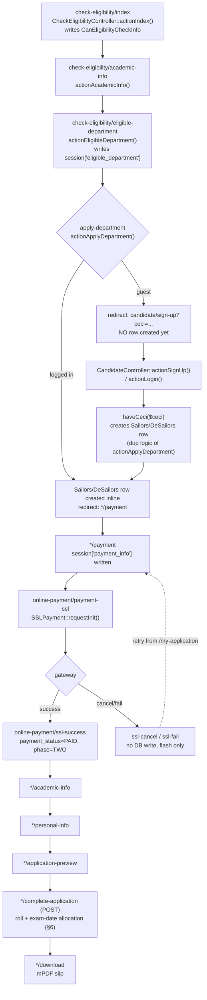
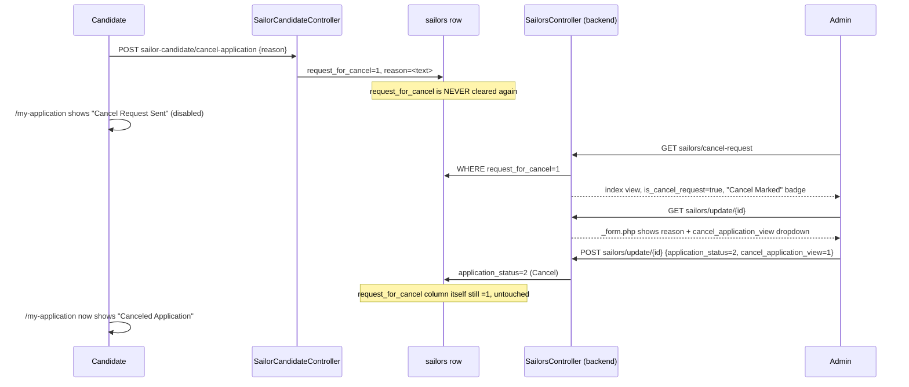

# Business Workflow Analysis — join-navy-sailor-legacy

**Generated:** 2026-08-20
**Scope:** All multi-step business workflows across the live route set of both Yii2 apps (`frontend/controllers/`, `backend/controllers/`), as already inventoried in `docs/00-inventories/controller_inventory.md` and cross-referenced in `docs/03-traceability/traceability_matrix.md`. Every claim below is cited with an exact file path and line number (or a quoted snippet) from the current working tree, re-verified by reading the actual controller/model source where the inventories describe an action in isolation but the cross-controller sequencing (session hand-offs, redirect chains, model-to-model hand-offs) isn't already spelled out. Nothing here is inferred without evidence in code.

This is a **Yii2 advanced-template** app — routes are the framework default `/{controller-id}/{action-id}`, there is no `routes/web.php` to read a route list from (see `route_inventory.md`). Route citations below use that `controller-id/action-id` form.

---

## Contents

1. [Eligibility Pre-Check → Signup Hand-off](#1-eligibility-pre-check--signup-hand-off)
2. [Application Submission — Sailor Track](#2-application-submission--sailor-track)
3. [Application Submission — DE-Sailor Track](#3-application-submission--de-sailor-track)
4. [Payment Workflow](#4-payment-workflow)
5. [Admin Review / Reference-Candidate / Cancel-Application Workflow](#5-admin-review--reference-candidate--cancel-application-workflow)
6. [Roll Number / Exam Center Allocation](#6-roll-number--exam-center-allocation)
7. [Reporting / Export Workflow](#7-reporting--export-workflow)
8. [Status-column reference](#8-status-column-reference)
9. [Mermaid — Eligibility → Application → Payment → Roll](#9-mermaid--eligibility--application--payment--roll)
10. [Mermaid — Cancel-Application Review Chain](#10-mermaid--cancel-application-review-chain)

---

## 1. Eligibility Pre-Check → Signup Hand-off

**Controller:** `frontend/controllers/CheckEligibilityController.php`
**Model:** `common\models\CanEligibilityCheckInfo` (table `can_eligibility_check_infos`)
**Hand-off targets:** `common\models\Sailors` / `common\models\DeSailors` (new application row), `frontend\controllers\CandidateController::haveCeci()`

This is a **standalone, no-login-required, no-`Sailors`/`DeSailors`-row** wizard (`check-eligibility/*`, the frontend app's `defaultRoute`). It writes only to `can_eligibility_check_infos` until the very last step, where the application row is created either directly or via an encrypted `ceci` hand-off through signup/login — the exact fork point the task asked to trace.

### Steps (route → controller::action → model)

| # | Step | Route | Controller::Action | Evidence |
|---|---|---|---|---|
| 1 | Personal info (DOB, gender, marital status, height ft/in→cm, eye status, district) | `check-eligibility/index` | `CheckEligibilityController::actionIndex()` | `frontend/controllers/CheckEligibilityController.php:36-84` |
| 2 | Academic info (JSC/SSC-equiv/HSC-equiv/O-Level/A-Level, trade-course) | `check-eligibility/academic-info/{slug}` | `CheckEligibilityController::actionAcademicInfo($slug)` | `frontend/controllers/CheckEligibilityController.php:91-124` — debug `print_r()`+`die()` on validation failure (line 111-114) |
| 3 | Compute eligible departments; **sets `Yii::$app->session['eligible_department']`** as a side effect of rendering the results view (not the controller) | `check-eligibility/eligible-department/{slug}` | `CheckEligibilityController::actionEligibleDepartment($slug)` | `frontend/controllers/CheckEligibilityController.php:130-367`; session write happens in the **view**, `frontend/views/check-eligibility/eligible_department.php:147-150` — an unusual place for a side effect, but real: `$session['eligible_department'] = $eligible_department;` runs every time the results table renders |
| 4 | Apply to a chosen department → **forks on login state** | `check-eligibility/apply-department/{slug}/{adpt}` | `CheckEligibilityController::actionApplyDepartment($slug, $adpt)` | `frontend/controllers/CheckEligibilityController.php:372-457` |

### The fork at step 4 (the exact hand-off the task asked about)

`actionApplyDepartment()` first re-validates the chosen department against the session-stored `eligible_department` list (`frontend/controllers/CheckEligibilityController.php:376-381`), resolves `batch_id`/`center_id` via `SailorBatchConfiguration::batchIdAndCenterIdByApplyDistrictAndDepartment()` (`common/models/SailorBatchConfiguration.php:222-248`, REGEXP-matched on district/gender/candidate-designation), then:

- **Guest candidate** (`Yii::$app->user->getIsGuest()`): **no `Sailors`/`DeSailors` row is created here.** The controller redirects straight to `candidate/sign-up` carrying the *`CanEligibilityCheckInfo` id* — not yet a Sailors id — encrypted as the `ceci` query param: `return $this->redirect(["candidate/sign-up", 'ceci' => StaticMethod::encryptPk($model->id)]);` (`frontend/controllers/CheckEligibilityController.php:399`).
- **Already-logged-in candidate**: the row is created **right here**, inline, not deferred — `new Sailors()` or `new DeSailors()` depending on `apply_department_type`, populated from the `CanEligibilityCheckInfo` row and the resolved batch/center, then `$sailor->save()` and an immediate redirect to `sailor-candidate/payment` or `de-sailor/payment` (`frontend/controllers/CheckEligibilityController.php:409-439`). A one-application-per-batch guard runs first via `Sailors::numberOfApplication()`/`DeSailors::numberOfApplication()`; if already applied, flash "Sorry you already applied once this batch" and bounce back to `eligible-department` (`frontend/controllers/CheckEligibilityController.php:440-443`).

So **there are two independent code paths that create the application row**, not one — this matters because they are not kept in sync by a shared helper; a future field added to one is easy to forget in the other (both are duplicated ~30-line blocks, see below).

### `CandidateController::haveCeci()` — the deferred path for guests

When a guest completes `candidate/sign-up` (or `candidate/login`) with a `?ceci=` query param still attached, `haveCeci($ceci)` runs **after** login succeeds (`frontend/controllers/CandidateController.php:86-102` for signup, `:201-214` for login), and is what actually performs the deferred row-creation:

1. Decrypts `ceci` back to the `CanEligibilityCheckInfo` id, loads it, and branches sailor-vs-de_sailor off `apply_department_type` (`frontend/controllers/CandidateController.php:237-240`).
2. Counts existing `Sailors`/`DeSailors` rows already tied to that `eligibility_info_id` (`:242-246`) — if `> 0`, returns `page = 'go-home'` (candidate already progressed past eligibility for this check, must re-run eligibility — handled by `actionSignUp`/`actionLogin` flashing "Please check eligibility again for apply" and redirecting to `/my-application`, `frontend/controllers/CandidateController.php:97-100`, `210-212`).
3. Otherwise re-resolves `batch_and_config_id` the same way `actionApplyDepartment()` does, re-checks the one-application-per-batch guard, and — **if clear** — builds and saves the same `Sailors`/`DeSailors` row inline (`frontend/controllers/CandidateController.php:262-291`), duplicating the row-construction logic from `CheckEligibilityController::actionApplyDepartment()` almost field-for-field (compare `frontend/controllers/CheckEligibilityController.php:410-427` with `frontend/controllers/CandidateController.php:264-287` — same fields, same order, independently maintained).
4. Returns `page = 'payment'` + the new row's id; `actionSignUp()`/`actionLogin()` then redirect to `sailor-candidate/payment` or `de-sailor/payment` accordingly (`frontend/controllers/CandidateController.php:88-92`, `203-207`).

### Business rules (the eligibility engine itself)

`actionEligibleDepartment()` is a real rules engine, not a flag check:

1. **Age window:** age computed via `StaticMethod::getDifferenceBetweenTwoDateYearMonth()` against each active batch's `circular_date` (falls back to today's date if no batch is running), then matched with a dynamic `OR`-of-`AND(min_age<=age, max_age>=age)` SQL clause per active batch (`frontend/controllers/CheckEligibilityController.php:173-232`).
2. **Gender/marital/JSC-result:** exact-match/REGEXP filters against `Eligibility` rows (`:220-222`).
3. **Height:** gender-specific `<=` comparison against `height_male`/`height_female` (`:226-229`).
4. **SSC-equivalent result + group:** `>=` GPA and `in_array` group match, further branching on trade-course/diploma requirements (biology-required flag, trade-course-experience flag, diploma-vs-trade-course mutual exclusivity) — `:254-313`.
5. **District/gender/designation cross-reference against active `SailorBatchConfiguration`:** builds `config_desig_candidate_type_wise[candidate_type] = [designation,...]` so the results view can grey out designations the candidate's district isn't mapped to (`:325-352`).
6. **Active-batch scoping:** only batches passing `isActive()->isActiveBatch()->isCircularCloseDateGraterCurrentDate()` scopes are considered at all (`:173-176`; scopes defined on `SailorBatchs`).

### Possible outcomes

- Match found → candidate clicks "Apply" → step 4 fork above.
- No match → view renders "Sorry! You are not eligible for any department." (`frontend/views/check-eligibility/eligible_department.php:156-158`).
- Chosen department not in the session's `eligible_department` list (stale/tampered `adpt` param) → flash "Sorry.You are not allow to apply your selected department" (`frontend/controllers/CheckEligibilityController.php:449-451`).
- No `SailorBatchConfiguration` row resolves for the district/department → `$sailor->save()` still attempted only if `$batch_and_config_id` is truthy; falsy → flash "Please try again after sometime." (`:445-447`).
- Already applied this batch → flash + bounce to `eligible-department` (`:440-443`, and the `haveCeci()` equivalent above).

---

## 2. Application Submission — Sailor Track

**Model:** `common\models\Sailors` (table `sailors`)
**Controller:** `frontend/controllers/SailorCandidateController.php`
**Access control:** only `payment`/`academic-info` are behind `AccessControl` (`roles => ['@']`); every later step relies on inline `Yii::$app->user->identity->id` scoping inside `findModel()` instead (`frontend/controllers/SailorCandidateController.php:39-59`, `:1077-1088`).

A `Sailors` row already exists by the time this workflow starts (created in §1). `findModel()` scopes every lookup to `created_by = Yii::$app->user->identity->id` (`:1079-1088`), so a candidate cannot open another candidate's application via a guessed/decrypted slug on these gated actions — but `actionDownloadForm()` and `actionVerifyCandidate()` bypass `findModel()` and query `Sailors::find()` directly with no ownership check (`:972-978`, `:1021-1026`), a pre-existing access-control gap noted in `traceability_matrix.md`, not a workflow defect.

### Steps (route → controller::action → model → next step)

| # | Step | Route | Controller::Action | `phase` gate on entry | `phase` set on success | Next step |
|---|---|---|---|---|---|---|
| 1 | Payment | `sailor-candidate/payment/{slug}` | `actionPayment($slug)` | `phase == SAILOR_PHASE_ONE` (else bounce to `/my-application`, `:81-84`) | unchanged here — session `payment_info` is written and control hands off to §4 | → [Payment Workflow](#4-payment-workflow) |
| 2 | Academic Info | `sailor-candidate/academic-info/{slug}` | `actionAcademicInfo($slug)` | `phase == SAILOR_PHASE_TWO` (else bounce, `:212-215`) | `SAILOR_PHASE_THREE` (`:348`) | `sailor-candidate/personal-info` |
| 3 | Personal Info | `sailor-candidate/personal-info/{slug}` | `actionPersonalInfo($slug)` | `phase == SAILOR_PHASE_THREE`, but **only enforced for non-POST requests** — `if ($sailor->phase != SAILOR_PHASE_THREE && Yii::$app->request->getMethod() != 'POST')` (`:413-416`) | `SAILOR_PHASE_FOUR` (`:537`) | `sailor-candidate/application-preview` |
| 4 | Application Preview | `sailor-candidate/application-preview/{slug}` | `actionApplicationPreview($slug)` | none — but if `serial_no` already set, redirects to `/my-application` (immutable-after-roll gate, `:651-654`) | n/a (read-only) | `sailor-candidate/complete-application` (POST, triggered from the preview page's submit) |
| 5 | Complete Application → roll/exam-date allocation | `sailor-candidate/complete-application/{slug}` | `actionCompleteApplication($slug)` | POST-only (`BadRequestHttpException` otherwise, `:918-920`); same `serial_no`-already-set / batch-closed guards (`:685-698`) | `SAILOR_PHASE_FIVE` (`:880`) | → [Roll Allocation](#6-roll-number--exam-center-allocation), then `sailor-candidate/download` |
| 6 | Download (PDF slip) | `sailor-candidate/download/{slug}` | `actionDownload($slug)` | none | n/a | mPDF stream, `exit()` (`:964-966`) |

### Business rules / validation gates

- **Payment retry-before-pay reconciliation** (identical pattern to §4 below, run from *this* controller): if `payment_status == UNPAID` but `validation_id` is already set, `actionPayment()` calls `SSLPayment::allRequestListByTranIds()` before building a new gateway session, to avoid double-charging a candidate whose earlier attempt actually succeeded at the gateway but never round-tripped back (`frontend/controllers/SailorCandidateController.php:111-137`).
- **SSC/HSC teletalk-result validation:** `actionAcademicInfo()` calls the external `StaticMethod::educationBoardResult()` API for SSC (mandatory — no skip flag, unlike the DE-Sailor track, see §3) and cross-checks the returned GPA/group against `Eligibility::eligibilityBySession($sailor->candidate_designation)` (`:248-314`); a GPA/group mismatch adds a validation error in Bengali and re-renders the form rather than saving.
- **Photo upload:** local temp file → `Yii::$app->r2Storage->uploadFile()` (Cloudflare R2) → local temp cleanup, with the old photo deleted from R2 on replace (`:481-522`).
- **Once `serial_no` is set, the application is immutable** — every one of `actionApplicationPreview()`/`actionCompleteApplication()` explicitly redirects to `/my-application` if `serial_no` is already populated (`:652-654`, `:686-688`), and there is no controller-level middleware equivalent to officer-legacy's `CanContinueApplication` — the check is duplicated inline in each action instead.
- **Batch-closed gate:** every step from Payment onward calls `SailorBatchs::isCandidateContinueApplication(batch_id, isPaid: payment_status)` and bounces to `/my-application` with a flash if the batch no longer accepts applications (`:103-107`, `:240-244`, `:453-457`, `:694-698`).

### Possible outcomes

- **Success:** all steps complete → payment succeeds (§4) → roll/exam-date allocated (§6) → candidate downloads the PDF slip.
- **Blocked mid-flow:** wrong `phase` for the requested step, batch closed, or already-rolled → redirect to `/my-application` with a flash (no hard error, no exception).
- **Cancelled by admin:** `application_status = Constants::NO (2)` — set only via the backend edit form (§5) — is checked in `frontend/views/my-application/index.php:76,105` to swap the candidate's list UI to "Canceled Application" instead of action buttons; **there is no equivalent of officer-legacy's middleware-level hard block** — a cancelled candidate whose session still has a valid `phase` could in principle still POST to a step action directly, since none of the frontend controllers re-check `application_status` before processing a step (confirmed: no `application_status` reference anywhere in `SailorCandidateController.php` or `DeSailorController.php`) — a real gap, not present in the officer-legacy sibling app.

---

## 3. Application Submission — DE-Sailor Track

**Model:** `common\models\DeSailors` (table `de_sailors`)
**Controller:** `frontend/controllers/DeSailorController.php`
**Access control:** **none** — no `behaviors()` override at all; relies purely on inline `Yii::$app->user->identity->id` checks that would fatal (not cleanly 403) for a guest (`traceability_matrix.md` §A4).

Structurally identical route-for-route to §2 (`payment` → `academic-info` → `personal-info` → `application-preview` → `complete-application` → `download`), same `SAILOR_PHASE_*` constants reused for `DeSailors.phase`. The differences that matter:

| Aspect | Sailor (`SailorCandidateController`) | DE-Sailor (`DeSailorController`) | Evidence |
|---|---|---|---|
| SSC/HSC teletalk validation | Always called, no skip path | **Skippable** via a `skipTeleTalkValidation` branch before calling `StaticMethod::educationBoardResult()` | `controller_inventory.md` §`DeSailorController.php` row 2; `frontend/controllers/DeSailorController.php` `actionAcademicInfo()` |
| Course/trade dropdown | N/A (sailor academic-info has no course selector) | Loads `hons_diploma_subject` or `trade_course_subject` from `Eligibility::eligibilityBySession()` depending on `candidate_type` (Artificer vs. Dockyard) to populate a course dropdown | `frontend/controllers/DeSailorController.php:166-180` |
| QR-code generation | Not present | **Dead code** — a full QR-generation block (`Da\QrCode`) is present but entirely commented out in `actionPersonalInfo()` | `controller_inventory.md` — "~lines 432-453" |
| `nextRollByBatchId()` return shape | Returns `['roll_no' => $roll_no]` (array), caller extracts `['roll_no']` | Returns the roll number **directly as a scalar** — different signature, but each caller correctly matches its own model's return shape, so not a live bug | `common/models/Sailors.php:1122-1135` vs. `common/models/DeSailors.php:1083-1093`; call sites `frontend/controllers/SailorCandidateController.php:727-731` vs. `frontend/controllers/DeSailorController.php:761` |
| `next_start_roll` override | **Present** — if the newly computed roll equals `batch_setting_info.next_start_roll_after + 1`, the roll is force-reset to `batch_setting_info.next_start_roll` (a manual roll-sequence restart knob) | **Absent** — `DeSailorController::actionCompleteApplication()` has no equivalent block | `frontend/controllers/SailorCandidateController.php:732-734` (present) vs. `frontend/controllers/DeSailorController.php:708-944` (absent — confirmed by full read, no `next_start_roll` reference anywhere in the file) |
| SMS notification | Commented-out `SendSms::sendSms()` call after roll generation | Not present at all (not even commented) | `controller_inventory.md` `SailorCandidateController` row `actionCompleteApplication` |
| `actionCancelApplication()` / `actionRefundPhone()` | **Present** — AJAX endpoints for cancel-request and refund-phone-number capture | **Absent entirely** — `DeSailorController.php` has no equivalent action; a DE-Sailor candidate has no self-service cancel path at all | `traceability_matrix.md` §A4 vs. §A7 — confirmed by controller method list, no `actionCancelApplication`/`actionRefundPhone` in `DeSailorController.php` |
| `actionVerifyCandidate()` dead code | ~17 unreachable lines after `return` | ~18 unreachable lines after `return` (references a further-dead `application_verification_pdf` view) | both confirmed in `controller_inventory.md` |

Everything else — payment retry-before-pay reconciliation, R2 photo upload, `serial_no`-immutability redirects, batch-closed gate, `haveCeci()`/`actionApplyDepartment()` row creation — is the same pattern as §2, just against `DeSailors` instead of `Sailors` (confirmed by full read of `frontend/controllers/DeSailorController.php:1-153` against the Sailor equivalent — byte-similar apart from `opt_a: 'de_sailor'` and DE-Sailor route targets).

**Notable asymmetry:** because DE-Sailor has no `actionCancelApplication()`, the backend's `request_for_cancel` review flow (§5) is **sailor-track-only** — `backend/controllers/DeSailorsController.php` has no `actionCancelRequest()` equivalent (confirmed against its full action list in `controller_inventory.md`/`traceability_matrix.md` §B5), and `common/models/DeSailors.php` was not grepped as having a `request_for_cancel` column reference anywhere outside migrations. A DE-Sailor candidate who wants to cancel has no in-app path to request it at all.

---

## 4. Payment Workflow

**Controllers:** `frontend/controllers/OnlinePaymentController.php` (gateway initiation + callbacks) working with `SailorCandidateController::actionPayment()` / `DeSailorController::actionPayment()` (the last pre-payment step, both tracks).
**Gateway class:** `common\models\payment\SSLPayment` — the live, working integration.
**Dead alternate path:** `common\models\payment\AamarPay` / `common\models\payment\ShurjoPayment` are **imported but do not exist anywhere in the repo** (`controller_inventory.md` "Broken references found" item 1). Three actions on the live `OnlinePaymentController.php` reference them — `actionPayment()`, `actionPaymentResponseDeSailor()`, `actionPaymentResponseSailor()` — and are routable but guaranteed PHP Fatal Errors if hit. A duplicate file, `OnlinePaymentController_shurjo_pay.php`, declares the identical FQCN and is never autoloaded (dead file, `traceability_matrix.md` line 36).

### Steps (both tracks converge on the same gateway controller)

| # | Step | Route | Controller::Action | Evidence |
|---|---|---|---|---|
| 1 | Candidate submits the Payment step; retry-reconciliation runs first if a prior unpaid attempt exists | `sailor-candidate/payment` (POST) / `de-sailor/payment` (POST) | `SailorCandidateController::actionPayment()` / `DeSailorController::actionPayment()` | `frontend/controllers/SailorCandidateController.php:99-178`; `frontend/controllers/DeSailorController.php:60-140` |
| 2 | `payment_info` array written to `Yii::$app->session`, candidate redirected | — (session hand-off, not a route) | `Yii::$app->session->set('payment_info', $payment_info)` | `frontend/controllers/SailorCandidateController.php:160`; `frontend/controllers/DeSailorController.php:122` — **both tracks write to the same session key `payment_info`**, no track-scoping prefix |
| 3 | Gateway session initiation — reads `payment_info` back out of session, calls `SSLPayment::requestInit()`, redirects to the gateway URL | `online-payment/payment-ssl` | `OnlinePaymentController::actionPaymentSsl()` | `frontend/controllers/OnlinePaymentController.php:33-55` |
| 4a | Gateway posts back success | `online-payment/ssl-success` (CSRF-exempt) | `OnlinePaymentController::actionSslSuccess()` | `frontend/controllers/OnlinePaymentController.php:18-30` (CSRF exemption), `58-124` |
| 4b | Candidate cancels at the gateway | `online-payment/ssl-cancel` (CSRF-exempt) | `OnlinePaymentController::actionSslCancel()` | `frontend/controllers/OnlinePaymentController.php:127-145` |
| 4c | Gateway posts back failure | `online-payment/ssl-fail` (CSRF-exempt) | `OnlinePaymentController::actionSslFail()` | `frontend/controllers/OnlinePaymentController.php:146-164` |

### The `value_b` re-authentication hand-off

`actionSslSuccess()` (and `-cancel`/`-fail`) parse the gateway's echoed `value_b` opaque param, formatted as `r_{sailor_id}#u_{user_id}` at initiation time (`'opt_b' => 'r_' . $sailor->id . '#u_' . Yii::$app->user->identity->id` — `frontend/controllers/SailorCandidateController.php:155`, identically in `DeSailorController.php:116`). The callback explodes it back apart and calls `Yii::$app->user->login($identity)` using the extracted `user_id` **without any password or token check** (`frontend/controllers/OnlinePaymentController.php:66-78`) — this is because gateway callbacks are server-redirected hits that may arrive without the original session cookie, so the app re-establishes identity purely from the round-tripped `value_b` string. The `value_a` field (`'sailor'`/`'de_sailor'`) is what routes the callback to the right model class (`:84-93`).

### Status changes (exact column + values)

| Column | Table(s) | Set to | When | Evidence |
|---|---|---|---|---|
| `payment_status` | `sailors`/`de_sailors` | `2` (Unpaid) — default at row creation | `Sailors`/`DeSailors` construction in §1 | column default, `common/models/Sailors.php` migration |
| `payment_status` | `sailors`/`de_sailors` | `1` (Paid) | Gateway callback success (`actionSslSuccess`) | `frontend/controllers/OnlinePaymentController.php:100` |
| `payment_status` | `sailors`/`de_sailors` | `1` (Paid) | In-app retry-reconciliation success (candidate re-submits Payment step while a prior transaction is found paid at the gateway via `SSLPayment::allRequestListByTranIds()`) | `frontend/controllers/SailorCandidateController.php:126`; `frontend/controllers/DeSailorController.php:87` |
| `phase` | `sailors`/`de_sailors` | `SAILOR_PHASE_TWO` (`2`) | Both success paths above | `frontend/controllers/OnlinePaymentController.php:101`; `SailorCandidateController.php:127`; `DeSailorController.php:88` |
| `validation_id`, `card_type`, `card_no`, `trans_date`, `ref_id`, `payment_api`, `amount`, `store_amount` | `sailors`/`de_sailors` | Populated from the gateway response payload | Both success paths | `frontend/controllers/OnlinePaymentController.php:95-103`; `SailorCandidateController.php:121-131` |
| `all_payment_response` | `sailors`/`de_sailors` | JSON array appended with the raw gateway response, for audit | `actionSslSuccess()` | `frontend/controllers/OnlinePaymentController.php:105-110` |
| `all_paid_tran_id`, `all_requested_tran_id` | `sailors`/`de_sailors` | JSON arrays tracking attempted/paid transaction ids, for retry reconciliation | In-app retry path | `frontend/controllers/SailorCandidateController.php:113-132` |

### Business rules

- **Amount** comes from `SailorBatchs::batchById($batch_id)['payment_amount']`; **gateway mode** (`live`/`sandbox`) from the same batch row's `payment_mode` (`SailorCandidateController.php:90-91`, `DeSailorController.php:51-52`) — a per-batch, not per-app-wide, live/sandbox toggle.
- **Retry-before-pay reconciliation** is the load-bearing anti-double-charge mechanism (see §2/§3 tables above) — without it, a candidate whose earlier gateway session actually succeeded but whose callback never landed (network blip, closed tab) would otherwise be shown a fresh payment form and could pay twice.
- **Fail/cancel paths perform no DB writes at all** — `actionSslCancel()`/`actionSslFail()` only re-authenticate the user from `value_b` and throw a caught exception that flashes "Payment failed." and redirects to `/my-application` (`frontend/controllers/OnlinePaymentController.php:139-144`, `158-163`); the `sailors`/`de_sailors` row is left exactly as it was (still `phase = SAILOR_PHASE_ONE`, still `payment_status = UNPAID`), so the candidate can simply retry from `/my-application`.

### The dead AamarPay/ShurjoPay branch (what it would have been)

Had the migration completed, `actionPayment()` (AamarPay initiation) would have paralleled `actionPaymentSsl()`, and `actionPaymentResponseSailor()`/`actionPaymentResponseDeSailor()` would have paralleled `actionSslSuccess()` — same `payment_status`/`phase`/gateway-field-population pattern, keyed off `status_code == AamarPay::AAMAR_PAY_SUCCESS` instead of `status == SSLPayment::PAYMENT_VALID`, and re-authenticating via the same `opt_b`-style `r_{id}#u_{id}` split (`frontend/controllers/OnlinePaymentController.php:172-284`). Since `AamarPay`/`ShurjoPayment` don't exist, none of this can execute — any request routed to `online-payment/payment`, `online-payment/payment-response-sailor`, or `online-payment/payment-response-de-sailor` (e.g. a stale IPN/webhook URL still configured at the AamarPay dashboard from before the SSLCommerz migration) is a guaranteed PHP Fatal Error, not a functioning fallback.

---

## 5. Admin Review / Reference-Candidate / Cancel-Application Workflow

**Controllers:** `backend/controllers/SailorsController.php` / `backend/controllers/DeSailorsController.php`
**Models:** `Sailors`/`DeSailors` (candidate record), `backend\models\SailorsReference` / equivalent `DeSailorsReference` (reference JSON-append)

### 5a. Reference-candidate JSON-append flow

Both `SailorsController::actionAddReferenceCandidate()` and `DeSailorsController::actionAddReferenceCandidate()` follow the identical pattern (confirmed by full read of the Sailor version, `backend/controllers/SailorsController.php:106-179`; the DE-Sailor equivalent is described identically in `controller_inventory.md`/`traceability_matrix.md` §B5):

1. Admin submits a `SailorsReference` form (`serial_no`, `referred_by`, `relationship`, `reference_details`) — AJAX-validated first, then POSTed for real.
2. The target `Sailors`/`DeSailors` row is looked up **by `serial_no`**, not by primary key (`:120-121`) — meaning reference-adding only works for candidates who already have a roll number assigned (post-§6).
3. Each of `referred_by`, `relationship`, `reference_details`, `reference_add_on` is stored as a **JSON-encoded array column** on the candidate row itself (not a child table) — existing JSON is decoded, the new entry is appended, and the whole array is re-encoded and saved (`:126-160`). This means an unbounded number of references can accumulate on one candidate row over time, all denormalized into four parallel JSON arrays kept in lock-step by array index (no explicit linking key between `referred_by[i]` and `relationship[i]` beyond shared array position).
4. `have_reference` flag flips to `YES` and `last_reference_added` timestamp updates (`:163-166`).
5. `actionReferenceCandidateUpdate($id)` is the edit/clear counterpart — if the posted form omits `referred_by` entirely, all four JSON columns and `have_reference` are nulled/reset rather than partially edited (`backend/controllers/SailorsController.php:214-221`) — an all-or-nothing clear, not a per-entry edit.
6. `actionReferenceCandidate()` (the list view) session-stores the current query params under `reference_candidate_query_param` (`:96`) — this is what `ReportController`/`DeSailorReportController`'s `actionReferenceCandidatePdf()`/`actionReferenceCandidateExcel()` read back out to regenerate the same filtered export without re-submitting the filter form (see §7).

### 5b. Cancel-application review chain — **not a dead end**

The task asked whether `request_for_cancel` (set by `SailorCandidateController::actionCancelApplication()`, §2/§3) is ever consumed on the backend, or is a dead-end flag. **It is consumed — there is a real review UI, fully traced below.**

| # | Step | Actor | Action | Evidence |
|---|---|---|---|---|
| 1 | Candidate submits a cancel request with a reason | Candidate | `POST sailor-candidate/cancel-application` (AJAX) → `Sailors.request_for_cancel = 1`, `Sailors.reason = <text>` | `frontend/controllers/SailorCandidateController.php:1142-1194` |
| 2 | Candidate's own application list flips the action button | Candidate (read) | `/my-application` view checks `request_for_cancel == YES && application_status == YES` → renders a disabled "Cancel Request Sent" button instead of the normal action buttons | `frontend/views/my-application/index.php:105-108` |
| 3 | Admin opens the dedicated cancel-request queue | Admin | `GET sailors/cancel-request` → `SailorsController::actionCancelRequest()`, filters `Sailors` `WHERE request_for_cancel = 1`, reuses the normal `index` view with `is_cancel_request = true` | `backend/controllers/SailorsController.php:62-76` |
| 4 | Admin opens one candidate's edit form; the reason is surfaced and a review-marker dropdown appears | Admin | `sailors/update` (`_form.php`) — **conditionally renders** `<span style='color:red'>Cancel Request Reason: {reason}</span>` plus a `cancel_application_view` dropdown (`Mark`/`Not Mark`) only `if ($model->request_for_cancel)` | `backend/views/sailors/_form.php:170-175` |
| 5 | Admin actually cancels the application | Admin | Same edit form always exposes an `application_status` dropdown (labelled "Is Cancel Application?"); setting it to `2` (`NO`/"Yes" in the inverted dropdown label) is the actual cancellation — posts through the same `SailorsController::actionUpdate($id)` as any other admin edit | `backend/views/sailors/_form.php:169`; `common/static/StaticMethod::isCanselApplication()` (`common/static/StaticMethod.php:110-117` — labels are inverted: value `1`=`Constants::YES` displays as "No", value `2`=`Constants::NO` displays as "Yes", i.e. the dropdown asks "Is Cancel Application?" and `1` means "No" (still active)) |
| 6 | Candidate's list reflects the outcome | Candidate (read) | Once `application_status == NO (2)`, `/my-application` renders "Canceled Application" instead of any action | `frontend/views/my-application/index.php:76,105-109` |
| 7 | The row-index badge in the admin cancel-request list | Admin | Grid shows a red "Cancel Marked" badge next to `app_unique_id` when `request_for_cancel==1 && cancel_application_view==1` | `backend/views/sailors/index.php:233-238` |

**One genuinely loose end:** `request_for_cancel` itself is **never reset back to `0`/`null` anywhere in the codebase** (confirmed — the only write to it besides the migration default is `SailorCandidateController::actionCancelApplication()` setting it to `1`; grep across the repo shows no other assignment). So once a candidate requests cancellation, the row stays in the `sailors/cancel-request` queue forever, distinguishable from a *processed* request only by the separate `cancel_application_view`/`application_status` fields the admin sets — a "mark reviewed" convention rather than a state machine, but not a dead flag: the review does happen, it's just tracked with a second field instead of clearing the first.

**DE-Sailor track has no equivalent chain at all** — see the asymmetry noted in §3: no `actionCancelApplication()` on the frontend, no `actionCancelRequest()` on the backend `DeSailorsController`.

### 5c. Every admin edit is logged app-wide, not per-controller

Unlike the officer-legacy sibling app (which calls a manual `LogService::upsertMarksAddLog()` from inside specific controller actions), this app registers a **global, application-level** `EVENT_BEFORE_ACTION` handler in `backend/config/main.php` (`on beforeRequest` → `Yii::$app->on(\yii\base\Application::EVENT_BEFORE_ACTION, ...)`, `backend/config/main.php:76-129`) that fires on **every** backend action, not just the reference/cancel ones described above. For any POST it logs the raw posted params (not a before/after diff) keyed by controller + `add`/`update`, to an NDJSON file in R2 storage (`action_log/<controller>/{add,update}.ndjson`); for GET it logs to a date-stamped file. This is what `backend/controllers/LogReportController.php::actionSiteActivity()` reads back for the admin-facing audit-log report (`backend/controllers/LogReportController.php:26-31`, `88-92`) — so an admin's `application_status`/`cancel_application_view` edit from §5b step 5 is automatically captured here with no extra code in `SailorsController` itself.

---

## 6. Roll Number / Exam Center Allocation

**Trigger:** `SailorCandidateController::actionCompleteApplication($slug)` / `DeSailorController::actionCompleteApplication($slug)`, POST-only, the same action for both tracks structurally (see §3 diff table for the two real differences).
**Models touched:** `Sailors`/`DeSailors` (roll fields), `SailorBatchConfiguration` (capacity/exhaustion), `SailorBatchConfigurationExamDate` (per-date sub-capacity).

### Algorithm, step by step (Sailor track; DE-Sailor is the same minus the `next_start_roll` override, see §3)

1. **Idempotency guard:** if `$sailor->exam_date || $sailor->serial_no` already set, just advance `phase` to `SAILOR_PHASE_FIVE` and redirect — no re-allocation (`frontend/controllers/SailorCandidateController.php:702-707`).
2. **Resolve candidate configurations:** `SailorBatchConfiguration::configurationByBatchCenterGenderCanDesigDistrictSlugAll()` finds all active config rows matching `batch_id` + `center_id` + REGEXP `gender`/`candidate_designation`/`district_slug`, ordered by `exam_group ASC` (`common/models/SailorBatchConfiguration.php:272-288`). Empty result → flash "Configuration missing..." and bounce to `/my-application` (`SailorCandidateController.php:721-724`).
3. **Compute the next roll number:** `Sailors::nextRollByBatchId()` takes `MAX(serial_no)` across the batch (restricted to rows that already have `exam_date`+`exam_group`+`serial_no` all set) and increments it, or falls back to `batch_setting_info['start_roll']` if this is the first roll in the batch (`common/models/Sailors.php:1122-1135`).
4. **`next_start_roll` override (Sailor only):** if the computed roll equals `batch_setting_info['next_start_roll_after'] + 1`, it is force-reset to `batch_setting_info['next_start_roll']` — a manual "restart the roll sequence at N" admin knob configured per-batch (`SailorCandidateController.php:732-734`).
5. **Group/config selection when multiple configs match:**
   - If `roll_swap_in_group == YES` on the first (lowest `exam_group`) config, **all** configs sharing that swap flag are candidate groups; otherwise only the single lowest-`exam_group` config is (`:739-747`).
   - `Sailors::sailorBatchAndGroupWiseCount()` counts existing candidates per candidate config id (`:751`).
   - Any config whose `group_no_of_candidate` capacity is **already met or exceeded** is deactivated in place (`SailorBatchConfiguration.status = NO`, saved immediately — `:772-777`) — this is the "capacity-exhaustion" mechanic the task named.
   - Among the remaining (non-exhausted) configs, the one with the **fewest** currently-assigned candidates is chosen (`:783-785`) — a load-balancing tie-break across parallel exam groups, not simple first-match.
   - If every candidate config is exhausted, flash "Internal Error, Please Try Again Later." and bounce (`:779-782`).
   - **Single-config case** (no multi-group branch): if that one config's capacity is already met, it is deactivated the same way and the candidate is bounced with "Configuration missing please contact with support" (`:789-807`) — note this is a **synchronous, one-request-at-a-time** capacity check with no locking; two candidates racing for the last slot in the same request window could both pass the check before either write lands (not verified against production traffic, just a structural observation from reading the code — no transaction/lock wraps this read-then-write).
6. **Exam-date sub-allocation within the chosen config:** `SailorBatchConfigurationExamDate::getListByConfigurationId()` loads all active exam-date sub-rows for the chosen config, ordered by date, indexed by id (`common/models/SailorBatchConfigurationExamDate.php:97-105`). The candidate is assigned to the exam date **following** the last-used one for that center/gender/designation combo (`Sailors::getLastRollExamDateByDesignationCenter()` → `SailorBatchConfigurationExamDate::getNextKeyValue()`, a circular next-in-list walk that wraps back to the first date if the last one was already the final entry — `SailorBatchConfigurationExamDate.php:110-126`), or the first date if this is the first candidate for that combo.
7. **Per-date max-candidate check (only if `configuration_model['check_max_candidate'] == YES`):** counts existing candidates already on the selected exam date (`Sailors::getTotalCandidateByExamDate()`); if the count has reached that date's `max_candidate_this_date`, `SailorBatchConfigurationExamDate::getNextAvailableExamDate()` walks forward through the remaining dates (again wrapping circularly) to find one under capacity, marking any it passes over as over-limit along the way (`SailorBatchConfigurationExamDate.php:129-`onward). If **no** date has room, flash "Configuration missing please contact with support" and bounce (`SailorCandidateController.php:860-863`).
8. **Commit:** `$sailor->exam_date`, `exam_date_id`, `exam_group`, `team`, `batch_config_id`, `serial_no` (= the computed roll, cast to string), `serial_generate_date` (today), `phase = SAILOR_PHASE_FIVE` are all set and saved with `save(false)` (validation bypassed — `SailorCandidateController.php:873-881`).
9. **Audit log + redirect:** the full (PII-decrypted) row is upserted to an R2-hosted per-batch NDJSON log via `Yii::$app->r2Storage->upsertCandidateLog()` (`:884-895`), then `Sailors::generateLog($sailor->id)` runs (builds a separate application-form-fields snapshot, `common/models/Sailors.php:1181-`onward), then redirect to `sailor-candidate/download`.

### Business rules / edge cases worth flagging

- **No transaction wraps steps 5-8** — the capacity check (read), the deactivation-on-exhaustion write, and the final roll-assignment write are three separate, unguarded DB round-trips. This is a structural race-condition risk under concurrent submissions near a group's capacity limit, not something exercised by this trace (no test/load evidence either way — flagged as a code-reading observation).
- **`start_roll` vs `next_start_roll`/`next_start_roll_after`** are three separate `batches` columns coordinating one linear counter — `start_roll` seeds the very first roll of the batch, `next_start_roll`/`next_start_roll_after` implement a manual "jump the sequence" override usable exactly once per configured breakpoint (Sailor track only).
- **`roll_from == Constants::ROLL_FROM_BATCH`** is the only branch actually implemented in both `actionCompleteApplication()` methods (the `if` condition's `else` branch is an empty comment, `SailorCandidateController.php:915-917`, `DeSailorController.php:937-939`) — i.e. the `batches.roll_from` column's `'confi'` alternative (per `controller_inventory.md`'s note on the column) has no live code path; every batch in practice must be configured with `roll_from = 'batch'` or roll generation silently does nothing on POST (falls through to the end of the action with no response).

---

## 7. Reporting / Export Workflow

**Controllers:** `backend/controllers/ReportController.php` (Sailor track, 1,605 lines, largest controller in the repo), `backend/controllers/DeSailorReportController.php` (DE-Sailor track, same pattern).
**Session-based filter persistence** — the pattern named in `controller_inventory.md`, traced here end-to-end for one representative pair of actions (`actionPayment()` → `actionPaymentPdf()`/`actionPaymentExcel()`); every other filter/export pair in both controllers (`candidate-filter`, `district-candidate`, `center-candidate`, `center-date-candidate`, reference-candidate exports) follows the identical shape.

### The pattern

1. **Filter form submission** writes both the **query results** and the **filter values themselves** into session, under fixed keys:
   ```php
   Yii::$app->session->set('report',  $sailor);          // the filtered result rows
   Yii::$app->session->set('filter_value',  $model->attributes); // the submitted filter form's values
   ```
   (`backend/controllers/ReportController.php:36-50`, inside `actionPayment()`.)
2. **Every export action for that same report reads the session back out instead of re-querying or accepting filter params of its own:**
   ```php
   if (Yii::$app->session->has('report')) {
       $session_value = Yii::$app->session->get('report');
       $filter_value_value = Yii::$app->session->get('filter_value');
       ...
   }
   ```
   (`backend/controllers/ReportController.php:60-62`, `actionPaymentPdf()`; same shape in `actionPaymentExcel()` — though that one only reads `session('report')`'s *existence* as a gate and doesn't actually use the filtered rows, see below.)
3. **Consequence:** the PDF/Excel export routes (`report/payment-pdf`, `report/payment-excel`, and their per-report siblings) are **not independently linkable or bookmarkable** — hitting them with no prior filter-form submission in the same session simply renders nothing (the `if (Yii::$app->session->has(...))` guard silently no-ops). An admin must always go through the on-screen filter form first in the same session; the export buttons are session-continuation links, not standalone API endpoints.
4. **Other report pairs reuse the same two session keys** (`report`, `filter_value`) across **different reports** (`actionCandidateFilter()`, `actionDistrictCandidate()`, `actionCenterDateCandidate()`, `actionCenterCandidate()` all write to the same `Yii::$app->session->set('report', ...)` — confirmed via `controller_inventory.md`'s per-action descriptions, all session-storing under the same generic pattern with no report-specific key namespace). This means **running a second report's filter form in the same browser session overwrites the first's session state** — an admin who filters "Payment Report", then filters "District Candidate" in another tab of the same session, then clicks "Export PDF" back on the Payment Report tab, will get the District Candidate's session data instead (or a stale mix), since both reports collide on the same `report`/`filter_value` session keys. Not verified against a live multi-tab session, but structurally unavoidable given the shared key names.
5. **`reference_candidate_query_param`** (§5a) is the one report-adjacent session key that *is* given a distinct name, avoiding the collision above — used specifically by `actionReferenceCandidatePdf()`/`actionReferenceCandidateExcel()` to recover the last reference-candidate list filter (`backend/controllers/SailorsController.php:96`; consumed in `ReportController::actionReferenceCandidatePdf()`/`actionAllReferenceCandidateExcel()` per `controller_inventory.md`).

### Two stub/incomplete exports found while tracing this

- `actionPaymentExcel()` (both `ReportController` and `DeSailorReportController`) — despite reading `session('report')`/`filter_value` correctly per the pattern above, the actual spreadsheet body writes only a literal `$sheet->setCellValue('A1', 'Hello World !')` placeholder (`backend/controllers/ReportController.php:96` region, confirmed in `controller_inventory.md`) — the session hand-off works, the export itself does not.
- `actionReferenceCandidateExcel()` on `DeSailorReportController` similarly writes only a `"We are working"` placeholder despite real query/filename logic around it (`controller_inventory.md` §B4).

### DE-Sailor track parity

`DeSailorReportController` mirrors every action name 1:1 (`actionPayment`/`actionPaymentPdf`/`actionPaymentExcel`, `actionCandidateFilter*`, `actionMonitoringApplication`, `actionReferenceCandidatePdf`/`actionReferenceDeCandidatePdf`/`actionReferenceCandidateExcel`) against `DeSailors` instead of `Sailors`, same session-key pattern, same PDF partials byte-identical to the Sailor-track ones in three cases (`report/pdf/candidate_filter_pdf.php` ≡ `de-sailor-report/pdf/candidate_filter_pdf.php`, etc. — `traceability_matrix.md` "Cross-cutting notes").

---

## 8. Status-column reference

| Table | Column | Values | Evidence |
|---|---|---|---|
| `sailors`/`de_sailors` | `payment_status` | `1`=Paid, `2`=Unpaid | `common/static/Constants.php:36-37` |
| `sailors`/`de_sailors` | `application_status` | `1`(`YES`)=Active, `2`(`NO`)=Cancel — dropdown label inverted, see §5b step 5 | `common/static/Constants.php:29-30`; `common/static/StaticMethod.php:110-117` |
| `sailors`/`de_sailors` | `phase` | `1`–`5`, `SAILOR_PHASE_ONE`…`FIVE` (shared constant set for both models) | `common/static/Constants.php:100-104` |
| `sailors`/`de_sailors` | `request_for_cancel` | `0`(default)/`1` — set once by the candidate, never cleared (see §5b) | `common/models/Sailors.php:139,451` |
| `sailors`/`de_sailors` | `cancel_application_view` | `1`=Mark, `2`=Not Mark — admin review marker, distinct from `application_status` | `backend/views/sailors/_form.php:173` |
| `sailors`/`de_sailors` | `is_manula_paid` | `1`=Yes/`2`=No — manual-payment override; when `YES`, backend `actionUpdate()` force-advances `phase` to `SAILOR_PHASE_TWO` | `backend/controllers/SailorsController.php` (`actionUpdate`, per `controller_inventory.md`) |
| `sailors`/`de_sailors` | `have_reference` | `1`=Yes/`2`=No — flips on first reference add (§5a) | `common/static/Constants.php:29-30`; `backend/controllers/SailorsController.php:163` |
| `sailor_batch_configurations` | `status` | `1`=Active/`2`=Inactive — flipped to Inactive automatically on capacity exhaustion (§6) | `common/static/Constants.php:8`; `frontend/controllers/SailorCandidateController.php:774-776` |
| `sailor_batch_configurations` | `check_max_candidate` | `1`=Yes/`2`=No — gates whether §6 step 7's per-date capacity check runs at all | `common/static/Constants.php:29-30`; `SailorCandidateController.php:839` |
| `sailor_batch_configuration_exam_dates` | `status` | `1`=Active/`2`=Inactive — only active rows are ever loaded into the circular next-date walk (§6 step 6) | `common/models/SailorBatchConfigurationExamDate.php:101` |
| `batches` | `roll_from` | `'batch'`=only implemented branch, `'confi'`=dead/unimplemented (§6) | `controller_inventory.md`; `common/static/Constants.php:60` |
| `batches` | `payment_mode` | `1`=Live/`2`=Sandbox — per-batch SSLCommerz environment toggle | `common/static/Constants.php:96-97` |
| `can_eligibility_check_infos` | `apply_department_type` | `1`=Sailor/`2`=DE-Sailor/`3`=DE-Sailor Dockyard — decides which model (`Sailors` vs `DeSailors`) gets created at the §1 hand-off | `common/static/Constants.php:12-15` |

---

## 9. Mermaid — Eligibility → Application → Payment → Roll



---

## 10. Mermaid — Cancel-Application Review Chain



---

## Cross-cutting notes

- **Two independent row-creation code paths** (§1: `CheckEligibilityController::actionApplyDepartment()` for already-logged-in candidates vs. `CandidateController::haveCeci()` for the guest→signup/login deferred path) duplicate the same ~15-line `Sailors`/`DeSailors` construction block. A field added to one at a future date is easy to miss in the other — flagged as a maintenance risk, not a current bug (both are currently in sync).
- **Payment session key collision across tracks:** both `SailorCandidateController::actionPayment()` and `DeSailorController::actionPayment()` write to the same `Yii::$app->session->set('payment_info', ...)` key (§4) — not a live bug (a candidate can only be mid-application on one track's payment step at a time in practice) but structurally the two tracks are not session-namespaced from each other.
- **Report session key collision across report types:** `ReportController`'s half-dozen filter/export report pairs all share the same two session keys `report`/`filter_value` (§7) — a genuine cross-report collision risk for an admin working multiple report tabs in one session.
- **`request_for_cancel` is a write-once flag** (§5b) — real review UI exists downstream, but the flag itself is never reset, so "processed" vs. "pending" cancellation requests are distinguished only by the separate `application_status`/`cancel_application_view` fields, not by `request_for_cancel` returning to its default.
- **DE-Sailor track has no cancellation path at all**, front or back (§3, §5b) — a genuine feature gap relative to the Sailor track, not an oversight in this analysis.
- **No transaction/locking around roll-number and capacity-exhaustion writes** (§6) — read-then-write-then-write-again across three unguarded DB round-trips per submission.
- **Global admin action logging is app-wide and automatic** (§5c), a materially different (and broader) mechanism than officer-legacy's per-controller manual `LogService` calls — worth knowing before assuming any given backend action is *unlogged* just because its controller doesn't reference a log service directly.
